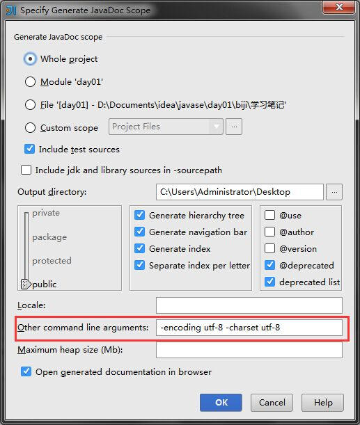

title: "IntelliJ IDEA生成javadoc时，乱码问题要注意两个参数的设置"
date: 2015-04-25 03:36:00
tags: [idea]
---
菜单栏 Tools->Generate JavaDoc 生成javadaoc

但是生成的时候经常乱码，添加一个参数的设置

Other command line arguments `-encoding utf-8 -charset utf-8`

