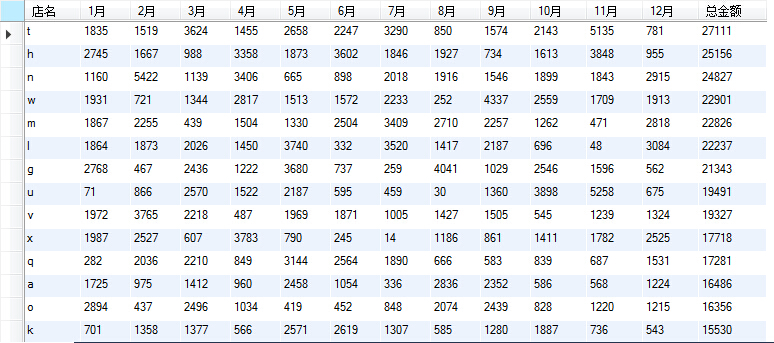

title: "sql查询各个店铺每个月的销售额和总销售额"
date: 2015-06-27 05:10:00
tags: [sql]
---
表主要三个字段，**店名**、**销售时间**、**销售额**。<br />
实现功能：<br />
==统计每个店每月的销售额和总销售额，并按总销售额的降序排列。==<br />
如图：


我用了12张临时表记录12个月的销售记录，之后用内连接，把所有的结果连接到一起，感觉不是最好的办法，想想子查询怎么做吧。

查询语句：
```sql
use test;
CREATE TEMPORARY TABLE t1 select name,sum(money) as '1月' from abcde as tt1  where month(ctime) = 1 group by name;
CREATE TEMPORARY TABLE t2 select name,sum(money) as '2月' from abcde as tt2  where month(ctime) = 2 group by name;
CREATE TEMPORARY TABLE t3 select name,sum(money) as '3月' from abcde as tt3  where month(ctime) = 3 group by name;
CREATE TEMPORARY TABLE t4 select name,sum(money) as '4月' from abcde as tt4  where month(ctime) = 4 group by name;
CREATE TEMPORARY TABLE t5 select name,sum(money) as '5月' from abcde as tt5  where month(ctime) = 5 group by name;
CREATE TEMPORARY TABLE t6 select name,sum(money) as '6月' from abcde as tt6  where month(ctime) = 6 group by name;
CREATE TEMPORARY TABLE t7 select name,sum(money) as '7月' from abcde as tt7  where month(ctime) = 7 group by name;
CREATE TEMPORARY TABLE t8 select name,sum(money) as '8月' from abcde as tt8  where month(ctime) = 8 group by name;
CREATE TEMPORARY TABLE t9 select name,sum(money) as '9月' from abcde as tt9  where month(ctime) = 9 group by name;
CREATE TEMPORARY TABLE t10 select name,sum(money) as '10月' from abcde as tt10  where month(ctime) = 10 group by name;
CREATE TEMPORARY TABLE t11 select name,sum(money) as '11月' from abcde as tt11  where month(ctime) = 11 group by name;
CREATE TEMPORARY TABLE t12 select name,sum(money) as '12月' from abcde as tt12  where month(ctime) = 12 group by name;

select abcde.name as '店名',1月,2月,3月,4月,5月,6月,7月,8月,9月,10月,11月,12月,sum(abcde.money) as '总金额'
from abcde
inner join t1 on abcde.name = t1.name
inner join t2 on abcde.name = t2.name
inner join t3 on abcde.name = t3.name
inner join t4 on abcde.name = t4.name
inner join t5 on abcde.name = t5.name
inner join t6 on abcde.name = t6.name
inner join t7 on abcde.name = t7.name
inner join t8 on abcde.name = t8.name
inner join t9 on abcde.name = t9.name
inner join t10 on abcde.name = t10.name
inner join t11 on abcde.name = t11.name
inner join t12 on abcde.name = t12.name
group by abcde.name
order by sum(abcde.money) desc;


drop table t1;
drop table t2;
drop table t3;
drop table t4;
drop table t5;
drop table t6;
drop table t7;
drop table t8;
drop table t9;
drop table t10;
drop table t11;
drop table t12;

```


测试数据记录
```sql
use test;
drop table abcde;
create table abcde(
	id int primary key auto_increment,
	name varchar(20),
	ctime date,
	money int
);

insert into abcde values(null,'o','2013-8-24',562);
```
